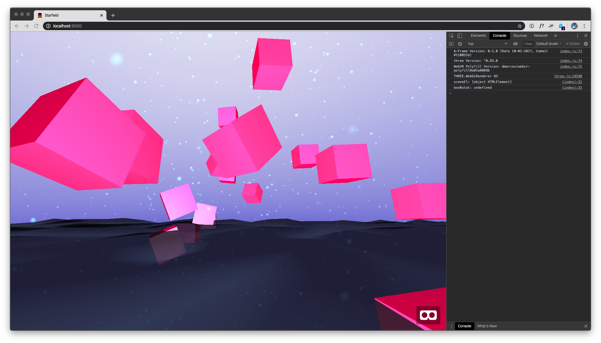

# Twilight Pink

# Glitch: https://telling-sticky-mollusk.glitch.me

# Refresh the Glitch page to see different arrangements of these deranged cubes.

### They're really not well.

## The Hell is This?

Goofy, yes. Messing around in a time of crisis.

Watching governor's livestream. Cuomo's brother is infected. Found out last night. Personal side of the governor. This shit's intense.

"Sweet guy. But now he's quarantined in the basement."

### So, yeah ...

A sketch I did while not sleeping ... initially because I was stressed out about the armageddon we're currently inhabiting, but also because I wanted to get back to work. So I did.

My first step into the A-Frame universe. For those who don't know:

https://github.com/aframevr/aframe

WebXR it is. It's a full on VR space running on your desktop, or phone, or headset. It doesn't really care.

And I'm not coding this in C#.

### What I was trying to do ...

... was to get randomly placed elements arranged programmatically in space.

Started out just playing with the aframe particle-system, then moved to objects based off some design i came across while working.

It wasn't at all interesting, so i had to add some animation. And when those animations were identical across all elements, I had to add still more randomness to the mix. And Voila! Agitated pink things twitching over an oil slick with ping pong electrons flitting about. Whatever.

Fun, actually.

Please don't take this seriously. I don't. There's already enough serious shit out there right now. Wait with me for Godot in Sarajevo.

## Working Notes

### A-Frame Upgrade + Broke out Asteroid Belt from Stormed at Sea

#### Tuesday, April 7, 2020 at 7:44:13 AM

WebXR wouldn't work in the Quest with existing version of the app. So set out to upgrade aframe. This broke nearly everything. Decided this was a good opportunity to work on the starfield idea I've been wanting to do.

So stripped out the ocean, sky and particle system. Replaced all that with randomply placed cubes hovering just outside the camera's position. This worked. Ended up keeping the swarming cubes, but now they oribit the randomly placed cubes.

This I like.

What would really set this off would be audio reactivity. Wondering about this one.

I've got Wednesday off from work, at which point I'll be working on my own shit. Wanna put a fair amount of time into C4D, but this project might make an appearance.

Oh yeah! ... this works beautifully in the Quest. Wanna show Andrey.

### Customizing look-controls

##### Friday, April 3, 2020 at 11:09:38 PM

https://aframe.io/docs/1.0.0/components/look-controls.html#customizing-look-controls

While A-Frame’s look-controls component is primarily meant for VR with sensible defaults to work across platforms, many developers want to use A-Frame for non-VR use cases (e.g., desktop, touchscreen). We might want to modify the mouse and touch behaviors.

The best way to configure the behavior is to copy and customize the current look-controls component code. This allows us to configure the controls how we want (e.g., limit the pitch on touch, reverse one axis). If we were to include every possible configuration into the core component, we would be left maintaining a wide array of flags.

The component lives within a Browserify/Webpack context so you’ll need to replace the require statements with A-Frame globals (e.g., AFRAME.registerComponent, window.THREE), and get rid of the module.exports.
